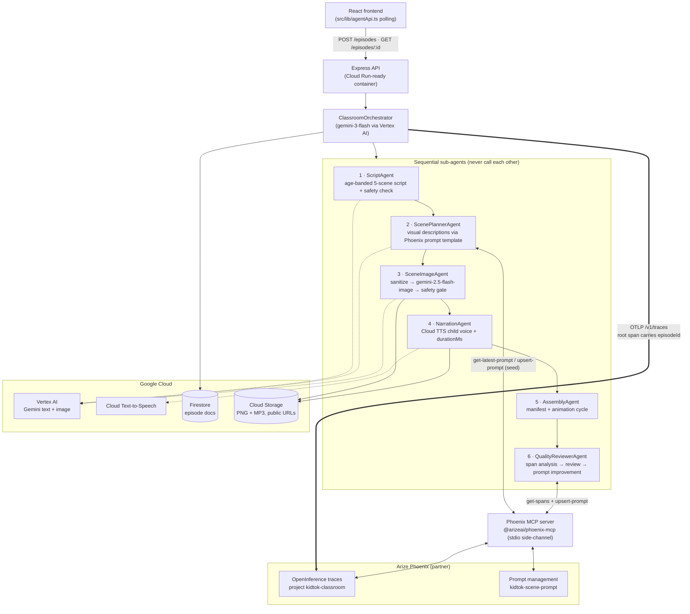

# KidTok Classroom 📺✨

**Type a topic, pick an age, get a narrated educational cartoon — generated end-to-end by a six-agent AI pipeline.**

KidTok Classroom turns a parent's request like *"why do volcanoes erupt"* into a five-scene illustrated, narrated mini-episode for kids ages 5–8. A React frontend polls a REST API while a central **ClassroomOrchestrator** drives six specialized sub-agents through scripting, scene planning, image generation, narration, assembly, and an automated quality review that closes the loop by improving its own prompts.

**Runtime mandate:** the shipped backend uses **only Google services** (Gemini via Vertex AI, Cloud Text-to-Speech, Firestore, Cloud Storage) **plus Arize Phoenix** (OpenInference tracing + MCP server) — nothing else.

---

## Repo layout

| Path | What it is |
|---|---|
| `/` (root) | React + Vite frontend (built with Lovable). Polls the agent service via `src/lib/agentApi.ts`. |
| `agent-service/` | The multi-agent backend (Node 22 + TypeScript, strict). This is where everything below lives. |
| `agent-service/legacy-reference/` | Battle-tested modules from the original KidTok product kept for reference. Their logic was **ported** into `agent-service/src/legacy/` (see `legacy-reference/PORTING.md`); files that referenced non-Google vendors were deleted after porting. |

## Quickstart

```bash
cd agent-service
npm ci
npm run build        # tsc --strict, zero errors
npm run smoke        # full offline pipeline test (fake providers, no credentials needed)
```

Run against real services (Google Cloud + Phoenix):

```bash
cp .env.example .env             # fill in every value
gcloud auth application-default login
npm start                        # or: npm run dev

# in another shell — runs 2 episodes and prints the manifest + prompt-loop evidence
npm run e2e
```

Docker:

```bash
docker build -t kidtok-agent-service ./agent-service
docker run -p 8080:8080 --env-file agent-service/.env kidtok-agent-service
```

Point the frontend at the service: set `VITE_AGENT_API_URL=http://localhost:8080` and run the Vite dev server from the repo root.

## API (consumed by `src/lib/agentApi.ts`)

| Route | Behavior |
|---|---|
| `POST /episodes` `{ topic, ageBand }` | `201 { id, episodeId }` — pipeline runs async in-process; Firestore doc tracks status |
| `GET /episodes/:id` | `{ id, topic, ageBand, createdAt, status, title?, scenes?, review?, error? }` |
| `GET /episodes` | All episodes, newest first |
| `GET /healthz` | Liveness + mode info |

Statuses: `scripting → planning_scenes → generating_images → narrating → reviewing → ready | failed`.
Each scene: `{ index, imageUrl, audioUrl, caption, durationMs, animation }` with animations cycling `kenburns-in / pan-left / kenburns-out / pan-right`.

## Architecture



### The self-improvement loop (partner integration, real at runtime)

1. Every pipeline stage runs inside an **OpenInference** span exported to **Phoenix** (`PHOENIX_HOST/v1/traces`, project `kidtok-classroom`); the root span carries `episodeId`.
2. Before planning scenes, **ScenePlannerAgent** fetches the latest `kidtok-scene-prompt` template through the **Phoenix MCP server** (`get-latest-prompt`), seeding it from the legacy template (`upsert-prompt`) on first run.
3. After assembly, **QualityReviewerAgent** retrieves *this episode's* spans via MCP (`get-spans`), evaluates stage latencies, image retries, and caption/narration alignment, writes `review: { score, notes }` to Firestore, and — when it detects a scene-prompt weakness — publishes an improved template version via `upsert-prompt`.
4. The **next episode's** ScenePlannerAgent picks up the improved version (logged with version ids; compare `review.promptVersionUsed` across episodes).

### Orchestration engine: ADK with a documented fallback

The primary engine uses the official **Google Agent Development Kit for TypeScript** (`@google/adk` 1.2.0): each LLM-backed role is a named ADK `LlmAgent` definition (`script_agent`, `scene_planner_agent`, `safety_check_agent`, `prompt_sanitizer_agent`, `review_alignment_agent`, `review_prompt_improvement_agent`) executed through the ADK `InMemoryRunner` with Gemini served by Vertex (`GOOGLE_GENAI_USE_VERTEXAI=true`). The ClassroomOrchestrator remains the single coordinator — sub-agents never call each other.

Set `ORCHESTRATOR_ENGINE=rest` to switch to the **fallback** path (same architecture, plain TypeScript pipeline calling Vertex `:generateContent` REST directly — ported from the legacy client). Both engines share the same provider interfaces, agents, tracing, and MCP integration. Deterministic stages (image generation, TTS, storage, assembly) call Google APIs directly in both engines; Phoenix MCP is reached through a minimal MCP stdio client (`@modelcontextprotocol/sdk`) spawning the pinned `@arizeai/phoenix-mcp` package from `node_modules`.

## Runtime mandate verification

| Mandate | Evidence (file : line) |
|---|---|
| (a) **Gemini invoked via Vertex AI / Agent Platform** | `agent-service/src/legacy/vertexRouting.ts:59` (`buildVertexUrl` → `*aiplatform.googleapis.com`); `agent-service/src/clients/gemini.ts:116` (text `:generateContent`) and `:172` (image `:generateContent`, `inlineData` parse); `agent-service/src/clients/adkLlm.ts:57` (ADK `LlmAgent` on Gemini) + `agent-service/src/config.ts:82` (`GOOGLE_GENAI_USE_VERTEXAI=true` pinned) |
| (b) **ADK agent definitions** (primary) / documented fallback | `agent-service/src/clients/adkLlm.ts:18` (`import { LlmAgent, InMemoryRunner } from "@google/adk"`), `:57` (`new LlmAgent({...})` named definitions), `:74` (`new InMemoryRunner`), `:91` (`runner.runAsync`). Fallback: `agent-service/src/clients/gemini.ts:106` (`VertexRestTextLlm`), selected at `agent-service/src/index.ts` via `ORCHESTRATOR_ENGINE` |
| (c) **Phoenix MCP tools invoked at runtime** | `agent-service/src/clients/phoenixMcp.ts:109-127` (spawn `@arizeai/phoenix-mcp` + MCP `connect`), `:175` (`get-latest-prompt`), `:198` (`upsert-prompt`, `model_provider: GOOGLE`), `:220` (`get-spans`). Call sites: `agent-service/src/agents/ScenePlannerAgent.ts:84-86` (fetch/seed) and `agent-service/src/agents/QualityReviewerAgent.ts:205` (spans) + `:285` (publish improved prompt) |
| OpenInference tracing → Phoenix | `agent-service/src/tracing.ts:56-57` (OTLP exporter → `PHOENIX_HOST/v1/traces`), `:46` (project resource attribute), root span `episodeId`: `agent-service/src/orchestrator/ClassroomOrchestrator.ts` (`runEpisode`) |
| Google Cloud TTS / Firestore / Cloud Storage only | `agent-service/src/clients/google.ts:12` (Firestore), `:44` (Cloud Storage), `:67-74` (Cloud TTS `synthesizeSpeech`) |

**Dependency audit** (`npm ls --depth=0` in `agent-service/`, all Google / Arize / OpenTelemetry / protocol / utility packages — no other AI, TTS, DB, queue, or cloud vendor):

```
kidtok-agent-service@1.0.0
├── @arizeai/openinference-semantic-conventions@2.5.0
├── @arizeai/phoenix-mcp@2.3.7
├── @google-cloud/firestore@7.11.6
├── @google-cloud/storage@7.21.0
├── @google-cloud/text-to-speech@6.4.1
├── @google/adk@1.2.0
├── @modelcontextprotocol/sdk@1.29.0
├── @opentelemetry/api@1.9.1
├── @opentelemetry/exporter-trace-otlp-proto@0.57.2
├── @opentelemetry/resources@1.30.1
├── @opentelemetry/sdk-trace-base@1.30.1
├── @opentelemetry/sdk-trace-node@1.30.1
├── @opentelemetry/semantic-conventions@1.41.1
├── @types/cors@2.8.19
├── @types/express@4.17.25
├── @types/node@22.19.21
├── cors@2.8.6
├── express@4.22.2
├── google-auth-library@9.15.1
├── music-metadata@11.13.0
├── tsx@4.22.4
├── typescript@5.9.3
└── zod@4.4.3
```

## Verification status

- ✅ `npm run build` — zero TypeScript errors (strict mode, `noUncheckedIndexedAccess`).
- ✅ `npm run smoke` — full offline pipeline run (fake providers): two episodes through the live HTTP API; verified the status flow, exactly 5 scenes with image+audio+duration, animation cycling, reviewer span retrieval (15 spans), weakness detection, prompt improvement, and **episode 2 picking up the new prompt version** (`fake-v1 → fake-v2`).
- ✅ Phoenix MCP server boot — the pinned `@arizeai/phoenix-mcp@2.3.7` was spawned from `node_modules` over stdio and its tool list verified: `get-latest-prompt`, `upsert-prompt`, `get-spans` all present (this server version exposes trace data via `get-spans`; it has no separate `list-traces` tool).
- ✅ Forbidden-vendor sweep — `grep -ri` across `agent-service/` (shipped code) finds zero references to any non-Google AI/TTS/DB/queue/cloud vendor; legacy-reference files that mentioned them were deleted after porting (see `agent-service/legacy-reference/PORTING.md`).
- ⚠️ `docker build` — **not executed** in the build environment (no Docker daemon available); the multi-stage Dockerfile was verified by inspection (`npm ci` → `tsc` → prod-deps-only runtime stage, `CMD node dist/index.js`, listens on `$PORT`).
- ⏳ Real-credential E2E (`npm run e2e`) — ready to run as soon as `GOOGLE_CLOUD_PROJECT_ID`, `GCS_BUCKET`, `PHOENIX_HOST`, `PHOENIX_API_KEY`, and Application Default Credentials are provisioned. It executes the volcano episode, prints the full manifest, then runs a second episode and asserts the Phoenix prompt-version pickup.

## Deployment notes (for the deployment pipeline)

- The container is Cloud Run-shaped: stateless, `$PORT`, ADC-based auth. Grant the runtime service account: `roles/aiplatform.user`, `roles/datastore.user`, `roles/storage.objectAdmin` (on the bucket), and Cloud TTS access.
- Public asset serving expects the bucket to allow public reads (uniform bucket-level access + `allUsers: roles/storage.objectViewer`, or non-uniform ACLs — the uploader handles both).
- Firestore must exist in Native mode; the `episodes` collection needs a single-field index on `createdAt` (descending) — auto-created by default settings.
- `gemini-3-flash` and `gemini-2.5-flash-image` must be enabled for the project; model ids are env-overridable (`GEMINI_TEXT_MODEL`, `GEMINI_IMAGE_MODEL`).
- Phoenix: any reachable instance works (`PHOENIX_HOST` + `PHOENIX_API_KEY`); traces land in project `kidtok-classroom`.
- Frontend: set `VITE_AGENT_API_URL` to the deployed service URL. CORS is open by design (demo).
