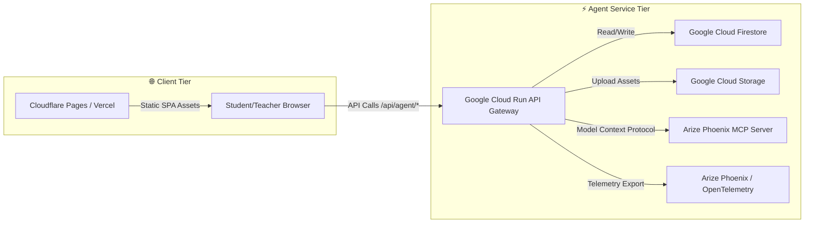

# KidTok Classroom Production Deployment & Hosting Guide

This guide describes how to deploy and host the complete multi-agent **KidTok Classroom** application in a production environment. 

---

## 🏛️ Architecture Overview

The application is split into two distinct tiers:



---

## ⚡ 1. Frontend Hosting (Cloudflare Pages or Vercel)

The frontend is a React Single Page Application (SPA) bundled with Vite. It can be hosted on any global edge network (e.g. Cloudflare Pages, Vercel, or Netlify).

### Deploying to Cloudflare Pages via CLI
1. Install wrangler:
   ```bash
   npm install -g wrangler
   ```
2. Build your local production assets:
   ```bash
   npm run build
   ```
3. Deploy to Cloudflare Pages:
   ```bash
   wrangler pages deploy dist/
   ```

### Frontend Environment Variables
Set the following environment variables in your Cloudflare Pages or Vercel dashboard:

| Variable | Required | Description | Example |
| :--- | :---: | :--- | :--- |
| `VITE_AGENT_API_URL` | Yes | Absolute URL pointing to your backend Cloud Run service. | `https://kidtok-agent-service-xxxxxx-uc.a.run.app` |
| `GOOGLE_CLIENT_ID` | Yes | Google OAuth Web Client ID for student/teacher login. | `12345678-abc.apps.googleusercontent.com` |

> [!WARNING]
> Do NOT prefix the Google Client ID variable with `VITE_` in Lovable, as Lovable rejects environment secrets with a `VITE_` prefix. Instead, name it `GOOGLE_CLIENT_ID`. The backend automatically exposes this securely to the client via the `/api/agent/config` endpoint if it's not set at build-time.

---

## ⚡ 2. Backend Hosting (Google Cloud Run)

The backend agent service runs inside a Docker container on Google Cloud Run. It orchestrates the six sub-agents and connects them to Vertex AI, Cloud Storage, Firestore, and Arize Phoenix.

### Deployment Prerequisites
Ensure the following services are enabled in your Google Cloud Project:
* Vertex AI API (`aiplatform.googleapis.com`)
* Cloud Firestore API (`firestore.googleapis.com`)
* Cloud Storage API (`storage.googleapis.com`)
* Secret Manager API (`secretmanager.googleapis.com`)

### Build and Deploy via Cloud Build
Run the following gcloud command inside the `agent-service` folder:
```bash
gcloud builds submit --tag gcr.io/YOUR_PROJECT_ID/kidtok-agent-service
```
Then, deploy the image to Cloud Run:
```bash
gcloud run deploy kidtok-agent-service \
  --image gcr.io/YOUR_PROJECT_ID/kidtok-agent-service \
  --platform managed \
  --region us-central1 \
  --allow-unauthenticated \
  --service-account kidtok-runtime@YOUR_PROJECT_ID.iam.gserviceaccount.com
```

### Runtime Environment Variables
Ensure these variables are configured in the Cloud Run service environment:

| Variable | Source / Value | Description |
| :--- | :--- | :--- |
| `GOOGLE_CLOUD_PROJECT_ID` | Auto | Your Google Cloud Project ID. |
| `GOOGLE_CLOUD_REGION` | `us-central1` | GCP Region for regional-policy Vertex calls. |
| `GCS_BUCKET` | `kidtok-classroom-assets-YOUR_PROJECT` | GCS bucket name to store paintings & voice recordings. |
| `FIRESTORE_COLLECTION` | `episodes` | Firestore collection to store cartoon metadata. |
| `PHOENIX_HOST` | `https://your-phoenix-instance.arize.com` | Endpoint URL of your Arize Phoenix collector. |
| `PHOENIX_API_KEY` | Secret Manager | Secure Arize Phoenix collector API key. |
| `PHOENIX_PROJECT` | `kidtok-classroom` | Target project name inside Arize Phoenix. |
| `KIE_API_KEY` | Secret Manager | API Key for Gemini Omni Video Generation fallback. |

---

## 🔒 3. Secret Manager & Security

All secure keys (`PHOENIX_API_KEY`, `KIE_API_KEY`, `ELEVENLABS_API_KEY`) live in **Google Secret Manager** and are accessed via the `kidtok-runtime` service account.

1. Grant the Secret Manager Secret Accessor role (`roles/secretmanager.secretAccessor`) to your Cloud Run service account.
2. Bind the secrets to your Cloud Run service as environment variables. Do NOT hardcode secret values into the codebase or write them to logs.
